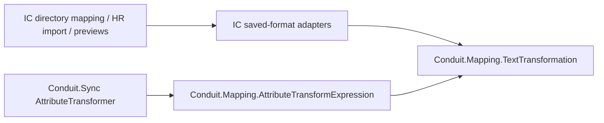

# CC-02: Conduit mapping embedded in IC

Implemented 2026-09-15 from the latest local sources. `Conduit.Mapping` is a
dependency-free .NET 8 library, owned here and referenced directly by both
Conduit.Sync and IdentityCenter DataAccessLibrary. It contains no database,
scheduler, HTTP client, settings lookup or service startup.

`TextTransformation` owns upper/lower/trim execution with explicit culture.
`AttributeTransformExpression` owns the existing Conduit pipeline language and
missing-source generation test. `AttributeTransformer` is a compatibility entry
point, with no second interpreter. Saved expression chaining, first-list-element
coercion, constants, defaults, prefix/suffix, substring, replace and unknown-stage
pass-through remain unchanged, including existing invalid-replace errors.

IC's adapters keep its formats and behavior: directory `ToUpper`/`ToLower` use
current culture; HR `Uppercase`/`Lowercase` and Conduit use invariant culture.
HR's whitespace/default, title-case and date rules remain IC-owned. Existing IC
configuration is not reinterpreted as Conduit's expression dialect. This is shared
execution with explicit compatibility policy, not interchangeable saved schemas.

## Build and verification

Normal Conduit builds restore the new project through Conduit.Sync. Normal IC
builds reference this sibling checkout; no running Conduit service is required.
IC's `ConduitSourceRoot` property supports coordinated isolated worktrees. The
resulting DLL flows into application outputs through project references.

139 focused offline tests passed: 33 shared mapping/Conduit adapter checks, 22
CC-01 connector regressions, and 84 IC mapping/preview checks (11 new). Zero
failures/skips. IC API solution restore/build also passed; warnings remain.
Conduit.Sync, IC API and WebPortal output hashes contain the identical mapping
DLL. All 102 combined changed source files match the tested isolated overlays.
12 offline checkout/configuration/layout checks and valid/missing-source MSBuild
checks passed, including an actual restore refusal with a named diagnostic.

`.github/workflows/shared-mapping.yml` runs the focused Conduit contract without
needing Brand or an IC checkout. It has not been executed on GitHub. IC's three
hosted build paths now fetch an explicit full Conduit commit; they deliberately
refuse absent configuration or a revision without the library. No commit is
invented for the unpublished working tree. Publish Conduit first when authorized,
then configure the reviewed revision in IC before publishing that consumer.
See IC `deploy/shared-conduit-build.md`.

Evidence: `../_review/conduit-local-mapping-20260915/README.md` relative to this
repository's root. No app/browser, live SQL/directory/email, migration, commit or
deployment was run. No full-solution/full-suite/live acceptance claim.

## Remaining boundary

The complete Conduit sync orchestrator and connectors are still separate from IC.
Conduit's own full-solution CI still needs its existing Brand checkout dependency
resolved. This focused workflow does not claim to fix that older pipeline.
CC-01 person matching remains an IC-owned business operation exposed to Conduit
by API; lifecycle, policy decisions and governance evidence stay in IC.

Follow-on [CC-03](IC-FIELD-PROJECTION.md) now shares source selection/projection and
default handling for Conduit's mapping step and IC's direct directory mapper.
Next: one read-only connector path behind shared contracts, retaining host
credential, tenant and authorization policy. Scheduling, persistence, schema/target
coercion convergence and side effects remain separate work.
